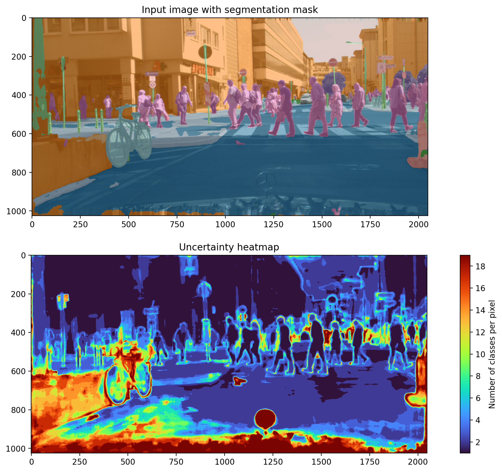

# COSE: Conformal Segmentation

This repository contains the implementation of the methods presented in our paper:
> Luca Mossina, Joseba Dalmau and Léo Andéol (2024). _Conformal Semantic Image Segmentation: Post-hoc Quantification of Predictive Uncertainty_. To appear.
>
> Preprint: https://hal.science/hal-04565173

We will present our work at the 2024 CVPR Workshop [SAIAD](https://sites.google.com/view/saiad-2024/accepted-papers), on 2024 June 18.

Citation: [see below](#citation)

## Idea
We apply Conformal Prediction to semantic image segmentation with multiple classes. Our contribution includes:
- Novel application of [Conformal Risk Control](https://openreview.net/forum?id=33XGfHLtZg) ([arXiv](https://arxiv.org/abs/2208.02814)), by Angelopoulos, A. N., Bates, S., Fisch, A., Lei, L., & Schuster, T. (2022);
- Novel visualization of conformal sets via heatmaps;
- Tests on multiple datasets: Cityscapes (automotive), ADE20K (daily scenes), LoveDA (aerial imaging).

An example of conformalized segmentation on the Cityscapes dataset:
<!--  -->

<!--  -->


## Get started
This repository relies on the libraries of the [OpenMMLab codebase](https://platform.openmmlab.com/modelzoo/) (via [`mmseg`](https://mmsegmentation.readthedocs.io/en/latest/) & `mmengine`) to handle the pretrained ML models and the datasets, and `pytorch` for all other things ML.

For the moment, you must either choose some existing models and datasets from `mmsegmentation` or adapt your code to this library.
We plan on releasing a more general version that works with basic pytorch and dataloaders, with minimal requirements (softmax output).

### 1. Make a virtual environment and install our repo
The following steps should ensure that the library and experiments run correctly:

1. Make a virtual environment named `.venv`, as specified in the [`Makefile`](Makefile)
    ```
    $ make venv
    $ make cose_path
    ```

2. Write the project's environmental variables to a file named `.env`, which should not be commited. For example:
    ```
    $ DATASET_NAME='Cityscapes'
    $ cd path/to/DATASET_NAME
    $ echo COSE_DATA_DATASET_NAME=$PWD >> ~/projects/vision/cose/.env
    ```
Repeat these steps for every dataset: "Cityscapes", "ADE20K", "LoveDA". 


### 2. Alternative installation
If the `make` commands above do not work, try to reproduce the following steps:

1. Create and activate virtual environment:
   ```
   $ python3.9 -m venv .venv
   $ source .venv/bin/activate
   ```
2. You must ensure that your GPU/CUDA, `pytorch` and `mmsegmentation` (and their dependencies) libraries are compatible. It can require a process of trial and error, uninstalling and reinstalling different version of the same package (e.g. `mmcv` below). For our our machines, this worked:
   ```
   $ .venv/bin/python -m pip install torch==1.13.1+cu116 torchvision==0.14.1+cu116 torchaudio==0.13.1 --extra-index-url https://download.pytorch.org/whl/cu116
   $ .venv/bin/python -m pip install -r requirements.txt
   $ .venv/bin/python -m pip uninstall mmcv
   $ .venv/bin/mim install mmcv
   ```
3. To install locally the `cose` packages (it allows to execute `cose` after modifying it, with a reload of the notebook):
   ```
   $ .venv/bin/python -m pip install --editable 
   ```


### 3. Software architecture: pytorch, mmsegmentation, etc.
For Conformal segmentation, we just assume that the **logits of an inference** are available from the prediction.
This could require you to modify the NN code to explicitly return them instead of the simple segmentation mask obtained via an argmax.

In this repo, we use [`mmsegmentation`](https://github.com/open-mmlab/mmsegmentation) and other packages of the [**OpenMMLab**](https://openmmlab.com) projects.
We use their models' specifications (pytorch), their pre-trained weights and their dataset wrappers.
Their repos are being actively developed and are vast: we only use a small set of tools, 
ignoring most of the pre-baked ones for training or running inferences.

If you use other models/dataset (e.g. via torch-hub), you will need to adapt your code to their idiosynchrasies (should be straightforward).

In the future, we would like to make a a version that does not depend on `mmseg`.
In the meantime, write an **issue** if you have problems.

### 4. Demo notebooks

**TODO**:
- Write some clean and simple [`notebooks`](notebooks/) to demo the approach


### 5. Interactive web applications
We wrote two simple applications (see [`./src/app`](src/app)) using the [Gradio](https://www.gradio.app/guides/quickstart) library by HuggingFace.
To run it, you must download the datasets and models we used in our experiments: [scripts/downloaders/download_mods_weights.ipynb](scripts/downloaders/download_mods_weights.ipynb).

1. [Thresholding app](src/app/app_threshold.py): observe how the value of the parameter $\lambda \in [0,1]$ influences the heatmap. This is the value we estimate with the CRC conformal algorithm.
2. [Conformal heatmap](src/app/app_vision.py): run inferences with pre-conformalized models


## Run the experiments
See the [README.md](experiments/README.md) in the [`./experiments`](experiments/) directory.

## Citation
```
@misc{Mossina_2024_conformal_segmentation,
    title = {Conformal Semantic Image Segmentation: Post-hoc Quantification of Predictive Uncertainty},
    author = {Mossina, Luca and Dalmau, Joseba and And{\'e}ol, L{\'e}o},
    year = {2024},
    howpublished = {https://hal.science/hal-04565173},
}
```
